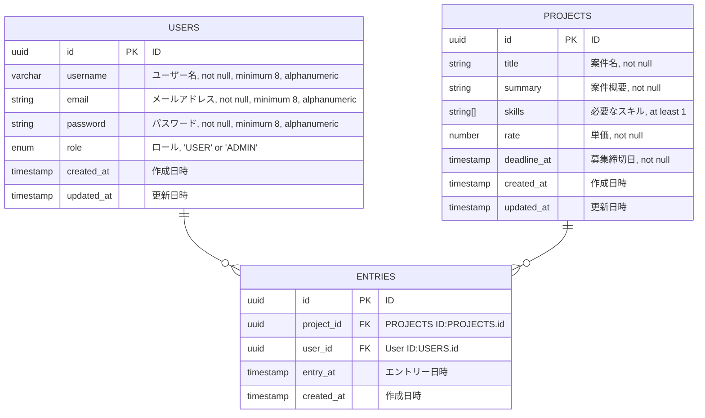

```mermaid
erDiagram
  USERS ||--o{ ENTRIES : ""
  PROJECTS ||--o{ ENTRIES : ""

  USERS {
    uuid id PK "ID"
    varchar username "ユーザー名, not null, minimum 8, alphanumeric"
    string email "メールアドレス, not null, minimum 8, alphanumeric"
    string password "パスワード, not null, minimum 8, alphanumeric"
    enum role "ロール, 'USER' or 'ADMIN'"
    timestamp created_at "作成日時"
    timestamp updated_at "更新日時"
  }

  PROJECTS {
    uuid id PK "ID"
    string title "案件名, not null"
    string summary "案件概要, not null"
    string[] skills "必要なスキル, at least 1"
    number rate "単価, not null"
    timestamp deadline_at "募集締切日, not null"
    timestamp created_at "作成日時"
    timestamp updated_at "更新日時"
  }

  ENTRIES {
    uuid id PK "ID"
    uuid project_id FK "PROJECTS ID:PROJECTS.id"
    uuid user_id FK "User ID:USERS.id"
    timestamp entry_at "エントリー日時"
    timestamp created_at "作成日時"
  }
```